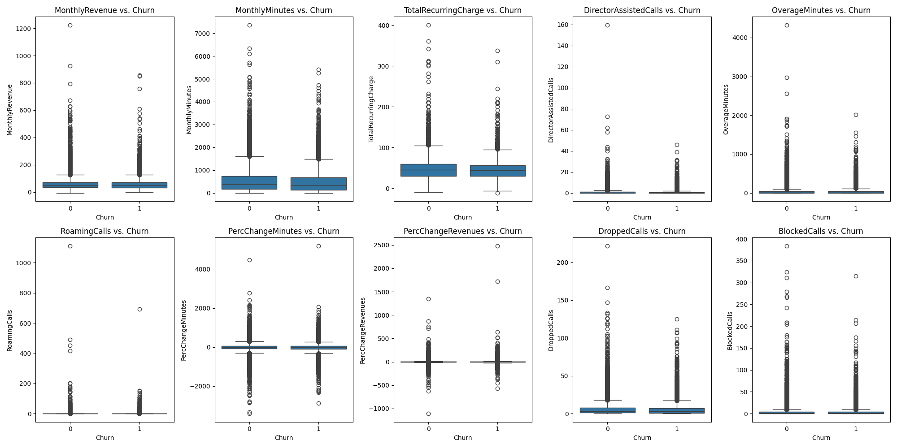
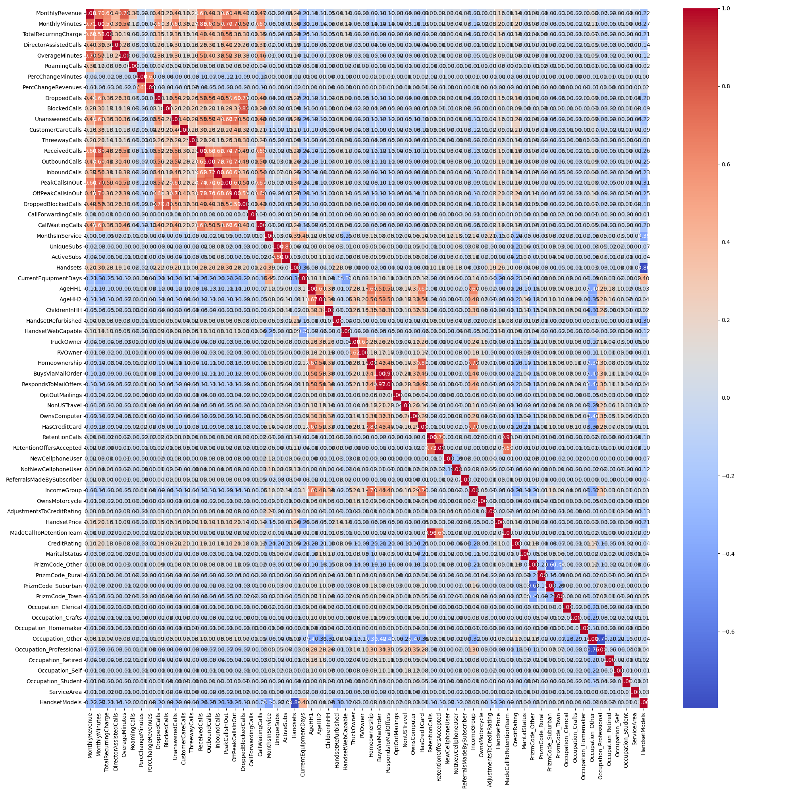
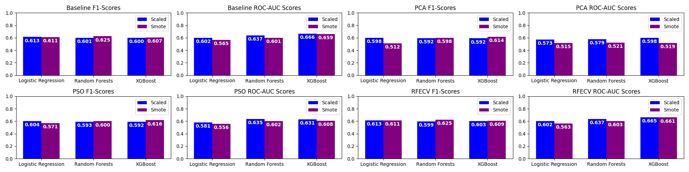
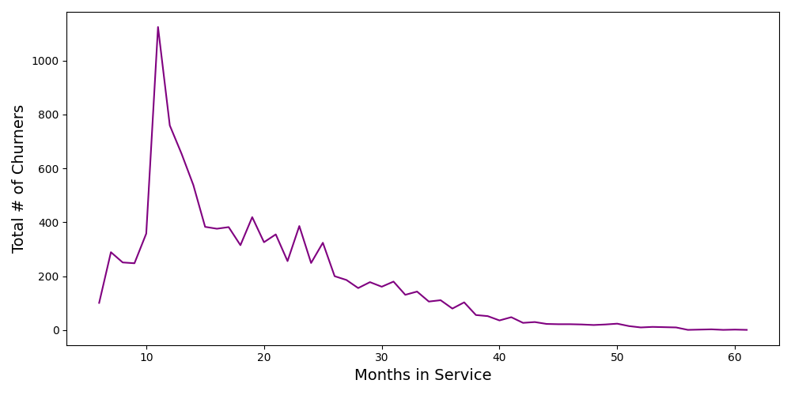

# cell2cell Customer Churn Dataset
***
This dataset is composed of data from Telecom on customer churn. It is a complex dataset
with 57 attributes, that requires careful consideration for multicollinearity, missing values,
feature transformations, and model selection. The aim of this project is to correctly
predict customer churn. I am using ROC-AUC and F1-Score to evaluate the performance of each
planned models.

[cell2cell Dataset](https://www.kaggle.com/datasets/jpacse/datasets-for-churn-telecom)
[DagsHub](https://dagshub.com/philjhowson/cell2cell)

## Project Organization
------------------------------------------------------------------------
    root
    ├── .dvc # DagsHub relevant files    
    ├── data 
    │   ├── processed # processed data hosted on DagsHub   
    │   └── raw # downloadable from kaggle link above
    ├── encoders # scalers, pca encoders etc.
    ├── images # output images
    │   ├── eda # images from eda  
    │   ├── .gitignore
    │   └── model_results.png
    ├── metrics # model scores
    │   ├── scaled # scores for scaled models
    │   └── smote # scores for smote models
    ├── models # model files, feature importances and model parameters
    │   ├── scaled # files for models trained on scaled data
    │   └── smote # files for models trained on smote data
    ├── src # python scripts
    │   ├── data # data exploration and preparation
    │   │   ├── data_exploration.py # visualization of data
    │   │   ├── data_formatting.py # data preparation
    │   │   ├── data_utils.py # functions used for data preparation
    │   │   ├── feature_engineering.py # feature scaling etc.
    │   │   ├── pso_feature_reduction.py # feature selection with pso
    │   │   ├── pso_utils.py # functions used for pso reduction
    │   │   ├── rfecv_feature_reduction.py # RFECV feature selection
    │   └── models # model training, evlauation, and visualization
    │       ├── general_utils.py # functions used by scripts
    │       ├── pso_training_utils.py # functions used by pso training
    │       ├── train_models.py # trains log, rf, and xgb models
    │       ├── train_pso.py # train log, rf, xgb models with pso reduction
    │       ├── training_utils.py # functions used by train_models.py
    │       ├── vis_utils.py # functions used by visualize_results.py
    │       └── visualize_results.py # visualization of model results 
    ├── .dvcignore
    ├── .gitignore
    ├── README.md
    ├── dvc.lock
    ├── dvc.yaml
    └── requirements.txt

## Project Introduction

The goal of this project is to test various models and their ability
to predict customer churn based on real world data using the cell2cell
dataset.

## Project Workflow

Before I explored the data, I performed some preprocessing. This included
replacing 'yes' and 'no' values with 0 and 1, replacing strings such as
'1-Highest' with 1, replacing 'Known' and 'Unknown' with 1 and 0, and
dropping columns that provide no information, such as 'CustomerID'.
Before continuing with feature engineering, I split the training and
test data to avoid data leakage that could be caused if imputer and
scaling techniques were fit with test data.

Generally speaking, where possible, I filled nan values with the median
value. I used OneHotEncoder for categorical columns where it would not
inflate the feature space too much (some columns had dozens of categories).
I used target encoders for the categories that had dozens or even hundreds
of categories in order to make the dataset somewhat simpler (e.g., 'ServiceArea').
I also performed SMOTE to upsample the 'Churn' examples as they were a relative
minority in the dataset.

Following this step, I performed EDA. I looked at 'Churn' by feature, correlations
between features, and the overall distribution of 'Churn' and 'NoChurn' in the
dataset. The main findings of the EDA were that there was very little difference
in the distribution of 'Churn' and 'NoChurn' clients. While there were significantly
less 'Churn' clients in the dataset, the medians, ranges, IQRs, were all similar
across 'Churn' and 'NoChurn' clients.

  

There were additionally a large number of features with very high correlations,
suggesting that feature reduction is not only possible, but may even be beneficial to
model performance.

  

Finally, I performed feature scaling, pca, and particle swarms and RFECV feature reduction.
For PSO feature reduction, I used a multitude of different settings to generate feature
sets for further testing.

Model training consisted of training a logistic regression, random forests, and XGBoost
model on baseline, pso reduced, RFECV reduced, and pca reduced datasets. I used grid
search parameters designed specifically to maximize test scores while minimizing 
overfitting. This means in some settings I removed reduced hyperparameter values if the
test set F1 and ROC-AUC scores deviated too far from the validation scores (generally
changing any hyperparameters which produced 0.1 difference). The XGBoost model
used a focal loss objective, following the methods described in Nguyen & Dong (2021).
The XGBoost model performed noticeably better than other models and the baseline model
outperformed every other model, except the RFECV reduced feature set XGBoost model.
The image below shows barplots for each of the different conditions and their F1
and ROC-AUC scores.

  

## Key Findings

The feature importances revealed a better picture of factors that play a role in
customer churn. A noteworthy finding was that customer care calls were found to
be negatively correlated to customer churn in the logistic regression model. This
is important because it means that making customer care calls to clients who are
considered higher risk for churn should reduce the number of customers who churn.

Additional, I find that there is a huge spike in churners at 11 months and this
steadily declines. This tells us that the longer the client has the service, the
less likely they are to churn. It would also be valuable to take time to analyze
what factors within the first year and especially around month 11 cause people
to churn. The plot below shows months in service on the x-axis and the total
number of all churners for each month.

  

The results also indicate that service area is a significant predictor for most
models, suggesting that specific needs of clients in certain areas are not being
met. A policy adjustment or targeted customer care calls and service offers for
these areas would likely increase retention.

'OverageMinutes' and 'PercChangeMinutes' are also relatively consistent and strong
predictors across datasets, suggesting that one factor for churn may be that
client needs are not being met with base services provided and a reassessment of
the packages offered to different clients based on their usage patterns could also
reduce churners.